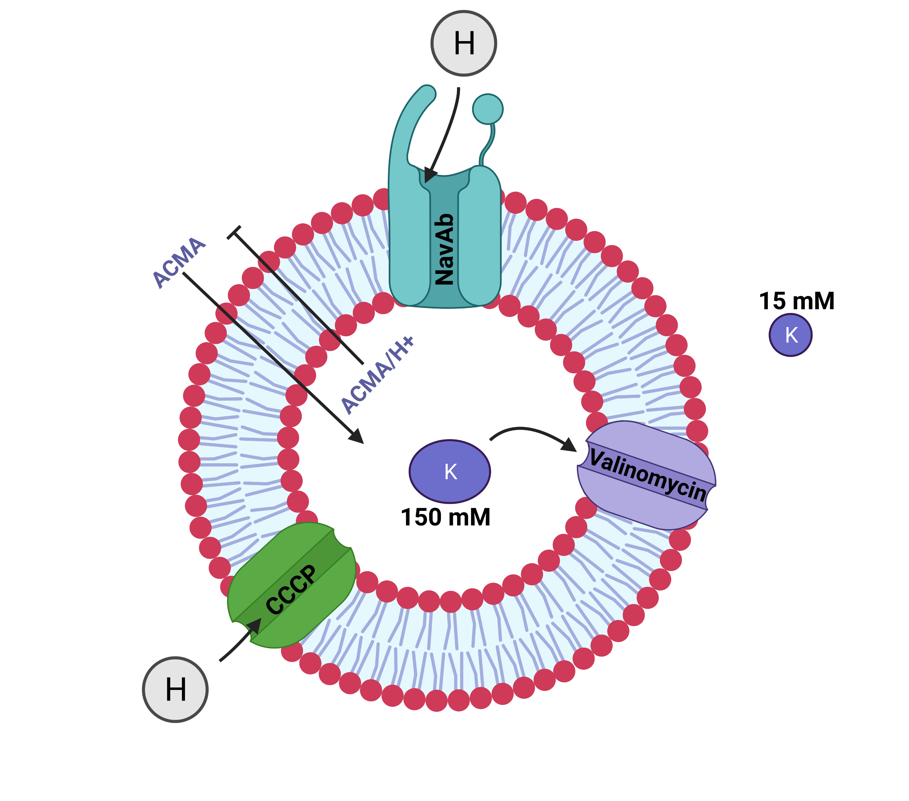
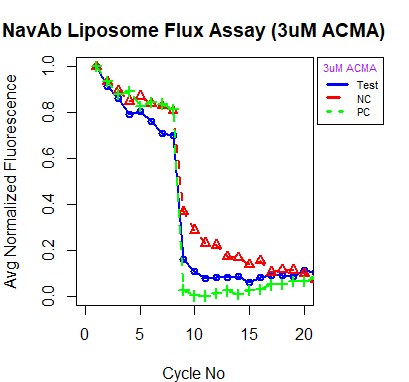

<!-- README.md is generated from README.Rmd. Please edit that file -->

```{r, include = FALSE}
knitr::opts_chunk$set(
  collapse = TRUE,
  comment = "#>",
  fig.path = "man/figures",
  out.width = "100%"
)
```

# normfluodbf 

[](https://github.com/AlphaPrime7/normfluodbf)
[](mailto:awesome.tingwei@outlook.com)
[](mailto:awesome.tingwei@outlook.com)
[](https://www.rstudio.com/categories/rstudio-ide/)
[](https://github.com/AlphaPrime7/normfluodbf/commits)
[](https://github.com/AlphaPrime7/normfluodbf/commits)
[](https://github.com/AlphaPrime7/normfluodbf_ShinyApp/graphs/contributors)
[](https://lifecycle.r-lib.org/articles/stages.html)
[](https://makeapullrequest.com)
[](https://github.com/AlphaPrime7/normfluodbf)
[](mailto:awesome.tingwei@outlook.com)
[](https://github.com/AlphaPrime7/normfluodbf/actions/workflows/test-coverage.yaml)
[](https://github.com/AlphaPrime7/normfluodbf/actions/workflows/R-CMD-check.yaml)
[](https://github.com/AlphaPrime7/normfluodbf/actions/workflows/pages/pages-build-deployment)
[](https://mit-license.org/)
[](https://github.com/AlphaPrime7/normfluodbf/graphs/commit-activity)
[](https://CRAN.R-project.org/package=normfluodbf)
[](https://cran.r-project.org/package=normfluodbf)
[](https://cran.r-project.org/package=normfluodbf)
[](https://cran.r-project.org/package=normfluodbf)
[](https://github.com/Naereen/badges)

# Introduction

[`{normfluodbf}`](https://github.com/AlphaPrime7/normfluodbf) is used to
clean and normalize DBF and DAT files obtained from liposome flux assay
experiments performed with the FLUOstar microplate reader. The
expectation is this package is not limited to this assay type but other
assay types performed with the same instrument. The final data frames
obtained from this package are ready for insightful data analysis and
for the creation of amazing visuals (using ggplot2) that help in making
scientific deductions or making presentations to project stakeholders.
This project firmly represents my core belief in the public
dissemination of scientific information. My convictions on this idea of
public dissemination were driven by the book "What Mad Pursuit" by
Francis Crick. Visit
[`{my page}`](https://alphaprime7.github.io/normfluodbf/articles/normfluodbf.html)
for details on the concept behind the project.



# ↓ Installation

## Developmental Version

The development version of
[`{normfluodbf}`](https://github.com/AlphaPrime7/normfluodbf) can be
installed as illustrated below:

```{r, eval = FALSE}
devtools::install_github("AlphaPrime7/normfluodbf")
```

```{r, eval = FALSE}
pak::pak("AlphaPrime7/normfluodbf")
```

```{r, eval = FALSE}
remotes::install_github("AlphaPrime7/normfluodbf")
```

## CRAN Version

The CRAN version of
[`{normfluodbf}`](https://github.com/AlphaPrime7/normfluodbf) can be
installed as illustrated below:

```{r, eval = FALSE}
install.packages("normfluodbf")
library(normfluodbf)
```

## Local Installation

-   Visit the
    [`{normfluodbf_builds}`](https://github.com/AlphaPrime7/normfluodbf_builds)
    to download the zip files into your desired directory.
-   This repository will be updated with the latest accepted CRAN
    version when possible.

```{r, eval = FALSE}
install.packages("normfluodbf_1.4.3.9000.tar.gz", repos = NULL, type = "source")
```

```{r, eval = FALSE}
library(devtools)
install_local("normfluodbf_1.4.3.9000.tar.gz")
```

```{r, eval = FALSE}
library(remotes)
remotes::install_local("normfluodbf_1.4.3.9000.tar.gz")
```

# Use Scenarios

## DBF Files Case-Study

-   Here examples are presented on how this package handles DBF files.

### Backward Compatible Function

-   This methodology is grandfathered for initial adopters of
    normfluodbf.
-   Package illustration with DBF files:

```{r exampledbfold, eval=F}
#library(normfluodbf)
liposomes_214 <- system.file("extdata", "liposomes_214.dbf", package = "normfluodbf")
normalized_data <- norm_tidy_dbf(liposomes_214, norm_scale = 'hundred')
```

### New Function

-   This next methodology provides easier syntax and I prefer this
    function name over the function name above.

```{r exampledbfnew, eval=F}
library(normfluodbf)
liposomes_214 <- system.file("extdata", "liposomes_214.dbf", package = "normfluodbf")
normalized_data <- normfluordbf(liposomes_214)
```

## DAT Files Case-Study

### Advanced Function

-   This methodology was provided as a minor update in normfluodbf
    1.4.3.9000.
-   This update was significantly bigger than expected and should have
    been a major update but by definition when backward compatibility is
    maintained with the previous version, it should be considered a
    minor update.
-   These three parameters are a MUST for this function to work.

```{r exampledatoptimus, eval=F}
library(normfluodbf)
dat1 <- system.file("extdata", "dat_1.dat", package = "normfluodbf")
normalized_data <- normfluodat(dat1, tnp = 3, cycles = 40)
```

### Base Function

-   This next methodology is the base version of the function above.
    This methodology has less features than the function above.

```{r exampledatbase, eval=F}
library(normfluodbf)
dat2 <- system.file("extdata", "dat_2.dat", package = "normfluodbf")
normalized_data <- normfluordat(dat2, tnp = 3, cycles = 40)
```

-   Please note that the examples above indicate the simplest scenarios
    as these functions have more features than presented in here.

## Advanced Features Illustration

### DBF Normalization Procedures

```{r exampledbfnormscaleold, eval=F}
library(normfluodbf)
liposomes_214 <- system.file("extdata", "liposomes_214.dbf", package = "normfluodbf")
normalized_data <- norm_tidy_dbf(liposomes_214, norm_scale = 'one')
normalized_data100 <- norm_tidy_dbf(liposomes_214, norm_scale = 'hundred')
normalized_dataz <- norm_tidy_dbf(liposomes_214, norm_scale = 'z-score')

# The user can add a transformation parameter
normalized_datazt <- norm_tidy_dbf(liposomes_214, norm_scale = 'z-score', transformed = 'log')
```

```{r exampledbfnormscalenew, eval=F}
library(normfluodbf)
liposomes_214 <- system.file("extdata", "liposomes_214.dbf", package = "normfluodbf")
normalized_data <- normfluordbf(liposomes_214, norm_scale = 'one')
normalized_data100 <- normfluordbf(liposomes_214, norm_scale = 'hundred')
normalized_dataz <- normfluordbf(liposomes_214, norm_scale = 'z-score')

# The user can add a transformation parameter
normalized_datazt <- normfluordbf(liposomes_214, norm_scale = 'z-score', transformed = 'log')
```

### DAT Advanced Procedures

#### Using The rows_used parameter

-   This parameter is used alone when the user loaded samples from
    column 1 and in sequence.
-   The default read direction is vertical.
-   If the cols_used parameter is not provided, the program will assume
    the user loaded from column 1 and did so in sequence. Attribute
    names will be added to the final data frame based on this
    assumption.

```{r exampledatru, eval=F}
library(normfluodbf)
dat2 <- system.file("extdata", "dat_2.dat", package = "normfluodbf")
n <- c('A','B','C')
normalized_data16 <- normfluodat(dat2, tnp = 3, cycles = 40, n)
```

-   Pay attention to the illustrations below. The setup below represents
    a standard experimental setup.

| Sample_Type (TNP) | 96  | 1   | 2   | 3   | 4   | 5   | 6   | 7   | 8   | 9   | 10  | 11  | 12  |
|:------------------|:----|:----|:----|:----|:----|:----|:----|:----|:----|:----|:----|:----|:----|
| Test              | A   | X1  | X2  | X3  | X4  | X5  | X6  | X7  | X8  | X9  | X10 | X11 | X12 |
| Negative          | B   | X13 | X14 | X15 | X16 | X17 | X18 | X19 | X20 | X21 | X22 | X23 | X24 |
| Positive          | C   | X25 | X26 | X27 | X28 | X29 | X30 | X31 | X32 | X33 | X34 | X35 | X36 |
|                   | D   |     |     |     |     |     |     |     |     |     |     |     |     |
|                   | E   |     |     |     |     |     |     |     |     |     |     |     |     |
|                   | F   |     |     |     |     |     |     |     |     |     |     |     |     |
|                   | G   |     |     |     |     |     |     |     |     |     |     |     |     |
|                   | H   |     |     |     |     |     |     |     |     |     |     |     |     |

-   The default or vertical read direction means the final data frame is
    presented in the format below.

| A1 (Test) | B1 (Negative) | C1 (Positive) | Cycle_No |
|:----------|:--------------|:--------------|:---------|
| A1        | B1            | C1            | 1        |
| A1        | B1            | C1            | 2        |
| A1        | B1            | C1            | 3        |
| A1        | B1            | C1            | 4        |
| A1        | B1            | C1            | 5        |
| A1        | B1            | C1            | 6        |
| A1        | B1            | C1            | ...38    |
| A1        | B1            | C1            | ...39    |
| A1        | B1            | C1            | ...40    |

#### Using The rows_used and cols_used parameter

-   The cols_used parameter is only used when the rows_used parameter is
    used.
-   The cols_used parameter is especially relevant when the user DOES
    NOT lead samples from column 1.
-   The default read direction is vertical as indicated earlier.

```{r exampledatrucu, eval=F}
library(normfluodbf)
dat2 <- system.file("extdata", "dat_2.dat", package = "normfluodbf")
n <- c('A','B','C')
c <- c(5,6,7)
normalized_data <- normfluodat(dat2, tnp = 3, cycles = 40, rows_used=n, cols_used=c)
```

| A5 (Test) | B5 (Negative) | C5 (Positive) | Cycle_No |
|:----------|:--------------|:--------------|:---------|
| A5        | B5            | C6            | 1        |
| A5        | B5            | C6            | 2        |
| A5        | B5            | C6            | 3        |

#### Using The user_specific_labels parameter

-   If the user provides the user_specific_labels parameter then they
    CANNOT use the rows_used and cols_used parameter together OR the
    rows_used parameter alone. It is a trade-off where the user either
    lets the program generate column names for them or the user decides
    to take CONTROL and do it themselves.
-   This user_specific_labels parameter is a proactive move from the
    user if the user had a complicated experimental setup that can lead
    to wrong attribute names.

```{r exampledatusl, eval=F}
library(normfluodbf)
dat2 <- system.file("extdata", "dat_2.dat", package = "normfluodbf")
manual_cols <- c('A1','B1','C1')
normalized_data <- normfluodat(dat2, tnp = 3, cycles = 40, user_specific_labels = manual_cols)
```

-   Hypothetically, if the user uses the rows and columns indicated in
    the examples in [Using The rows_used and cols_used
    parameter](#Using%20The%20rows_used%20and%20cols_used%20parameter)
    but skips some wells, then the user can simply go ahead and use the
    user_specific_labels to add the correct column names for the final
    data frame.

-   However, if the scenario above occurs where the user indicates 9
    wells should be used but the program detects fewer than 9 samples,
    then the program will inform the user and ask the user to choose
    from a list of column names. Illustration below:

| Sample_Type (TNP) | 96  | 1   | 2   | 3   | 4   | 5   | 6   | 7   | 8   | 9   | 10  | 11  | 12  |
|:------------------|:----|:----|:----|:----|:----|:----|:----|:----|:----|:----|:----|:----|:----|
| Test              | A   | X1  |     | X3  | X4  |     |     |     |     |     |     |     |     |
| Negative          | B   |     |     |     |     |     |     |     |     |     |     |     |     |
| Positive          | C   | X25 |     |     | X28 | X29 |     |     |     |     |     |     |     |
|                   | D   |     |     |     |     |     |     |     |     |     |     |     |     |
|                   | E   |     |     |     |     |     |     |     |     |     |     |     |     |
|                   | F   |     |     |     |     |     |     |     |     |     |     |     |     |

#### Using The read_direction parameter

-   As indicated in all the previous examples, the default read
    direction is vertical and I have provided illustrations in the form
    of tables that shows the expected outcome.
-   The read_direction can be indicated explicitly as vertical or left
    as NULL but must be indicated explicitly as horizontal to obtain a
    different outcome.

```{r exampledatrd, eval=F}
library(normfluodbf)
dat2 <- system.file("extdata", "dat_2.dat", package = "normfluodbf")
manual_cols <- c('A1','B1','C1')
normalized_data <- normfluodat(dat2, tnp = 3, cycles = 40, n, read_direction = 'horizontal')
```

| Sample_Type (TNP) | 96  | 1   | 2   | 3   | 4   | 5   | 6   | 7   | 8   | 9   | 10  | 11  | 12  |
|:------------------|:----|:----|:----|:----|:----|:----|:----|:----|:----|:----|:----|:----|:----|
| Test              | A   | X1  | X2  | X3  | X4  | X5  | X6  | X7  | X8  | X9  | X10 | X11 | X12 |
| Negative          | B   | X13 | X14 | X15 | X16 | X17 | X18 | X19 | X20 | X21 | X22 | X23 | X24 |
| Positive          | C   | X25 | X26 | X27 | X28 | X29 | X30 | X31 | X32 | X33 | X34 | X35 | X36 |
|                   | D   |     |     |     |     |     |     |     |     |     |     |     |     |
|                   | E   |     |     |     |     |     |     |     |     |     |     |     |     |
|                   | F   |     |     |     |     |     |     |     |     |     |     |     |     |
|                   | G   |     |     |     |     |     |     |     |     |     |     |     |     |
|                   | H   |     |     |     |     |     |     |     |     |     |     |     |     |

-   The horizontal read direction means the final data frame is
    presented in the format below.

| A1 (Test) | A2 (Test) | A3 (Test) | Cycle_No |
|:----------|:----------|:----------|:---------|
| A1        | A2        | A3        | 1        |
| A1        | A2        | A3        | 2        |
| A1        | A2        | A3        | 3        |
| A1        | A2        | A3        | 4        |
| A1        | A2        | A3        | 5        |
| A1        | A2        | A3        | 6        |
| A1        | A2        | A3        | ...38    |
| A1        | A2        | A3        | ...39    |
| A1        | A2        | A3        | ...40    |

#### Using The norm_scale parameter

-   Just like the DBF procedure, I have provided a few options for
    normalization scales.
-   My favorite is the z-score scale as it provides more clarity in
    thinking about the results.

```{r exampledatnormscale, eval=F}
library(normfluodbf)
dat2 <- system.file("extdata", "dat_2.dat", package = "normfluodbf")
manual_cols <- c('A1','B1','C1')
normalized_data <- normfluodat(dat2, tnp = 3, cycles = 40, n, read_direction = 'horizontal', norm_scale = 'hundred')
```

## The Non-standard Experimental Setup

-   Below is a look at the non-standard experimental setup.

| Sample_Type | 96  | Test | Negative | Positive | 4   | 5   | 6   | 7   | 8   | 9   | 10  | 11  | 12  |
|:-----|:-----|:-----|:-----|:-----|:-----|:-----|:-----|:-----|:-----|:-----|:-----|:-----|:-----|
|             | A   | X1   | X2       | X3       | X4  | X5  | X6  | X7  | X8  | X9  | X10 | X11 | X12 |
|             | B   | X13  | X14      | X15      | X16 | X17 | X18 | X19 | X20 | X21 | X22 | X23 | X24 |
|             | C   | X25  | X26      | X27      | X28 | X29 | X30 | X31 | X32 | X33 | X34 | X35 | X36 |
|             | D   |      |          |          |     |     |     |     |     |     |     |     |     |
|             | E   |      |          |          |     |     |     |     |     |     |     |     |     |
|             | F   |      |          |          |     |     |     |     |     |     |     |     |     |
|             | G   |      |          |          |     |     |     |     |     |     |     |     |     |
|             | H   |      |          |          |     |     |     |     |     |     |     |     |     |

-   Below we take a look at what the machine sees.

| Sample_Type | Cycle_No | Machine_data_verbose | machine_data_numeric |
|:------------|:---------|:---------------------|:---------------------|
| Test-1      | 1        | A1                   | 1                    |
| Test-2      | 1        | B1                   | 2                    |
| Test-3      | 1        | C1                   | 3                    |
| Test-1      | 2        | A1                   | 4                    |
| Test-2      | 2        | B1                   | 5                    |
| Test-3      | 2        | C1                   | 6                    |
| Test-1      | 40       | A1                   | ...118               |
| Test-2      | 40       | B1                   | ...119               |
| Test-3      | 40       | C1                   | ...120               |

-   A keen observation below is that the vertical read direction in the
    program or package yields a final data frame that conceptually looks
    like the horizontal read direction with the test samples clustered
    as in the illustration below.
-   Using the non-standard setup simply affects attribute naming
    conventions otherwise everything should be fine.

| A1 (Test-1) | B1 (Test-2) | C1 (Test-3) | Cycle_No |
|:------------|:------------|:------------|:---------|
| A1          | B1          | C1          | 1        |
| A1          | B1          | C1          | 2        |
| A1          | B1          | C1          | 3        |
| A1          | B1          | C1          | 4        |
| A1          | B1          | C1          | 5        |
| A1          | B1          | C1          | 6        |
| A1          | B1          | C1          | ...38    |
| A1          | B1          | C1          | ...39    |
| A1          | B1          | C1          | ...40    |

-   Below is just a quick illustration of the non-standard setup. This
    setup does not change anything about the algorithms but simply
    showcases how naming conventions will reverse if the experimenter
    deviates from the commonly used path.

## Fail Safe DAT Procedure

-   As indicated earlier, the code chunk below is the simplest use case
    for this function.
-   AHOI, the user gets a data frame with the samples perfectly
    separated but with NO attribute names.
-   Very important to mention this point twice.

```{r exampledatfailsafe, eval=F}
library(normfluodbf)
dat1 <- system.file("extdata", "dat_1.dat", package = "normfluodbf")
normalized_data <- normfluodat(dat1, tnp = 3, cycles = 40)
```

## Quality Control (QC)

-   Experimental issues should be investigated at very high or very low
    fluorescence values.

-   The most common experimental issues arise when ACMA concentrations
    are out of the tolerated range. Based on my experience, ACMA
    concentrations between 2 and 5 Micromolar will suffice to get
    fluorescence values within the tolerance threshold.

-   ACMA concentrations as low as 0.2 Micromolar or as high as 20
    Micromolar have proven problematic based on my research experience.
    These ACMA concentrations have proven NOISY and provide the basis
    for determining the noise-signal regions.

-   Another issue linked to the FLUOstar instrument revolves around
    setting the right "gain" to ensure the right level of sensitivity in
    machine readings. A very high "gain" setting results in increased
    machine sensitivity even at the right ACMA concentrations and vice
    versa. In short, we want the machine to be primed to read exactly
    what we feed it, no more, no less.

-   This program boasts of a quality control function to help new
    researchers avoid pitfalls that can mar their experience performing
    experiments.

-   Within this package, a QC function is designed to check that
    fluorescence values do not exceed the upper limit (2\^15 or 32768)
    OR fall below the lower limit (2\^11 or 2048). Fluorescence values
    that exceed these thresholds are considered noisy and can lead to
    incorrect interpretation of analysis results.

## Visualization

-   This time around, the package has a visualization function that is
    build on ggplot2.
-   Users can expect to get some amazing visualizations using this
    function.
-   Here are some visualizations from my seminar on this topic. These
    were done with base R.




## Epilogue

-   It was interesting getting this package to maturity.
-   Users are advised to default to the simplest use cases if they find
    the learning curve (LC) for the package too steep.
-   I am almost certain there is always something to improve but I can
    say this package is officially complete based on the project scope.

# References

[@R-data.table] [@R-dplyr] [@R-emojifont] [@R-foreign] [@R-ggplot2] [@R-ggthemes] [@R-stringr] [@R-tibble] [@R-tidyr]
