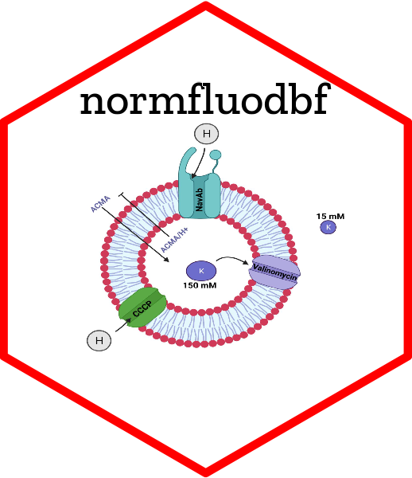

<!-- README.md is generated from README.Rmd. Please edit that file -->

```{r, include = FALSE}
knitr::opts_chunk$set(
  collapse = TRUE,
  comment = "#>",
  fig.path = "man/figures/README-",
  out.width = "100%"
)
```

# normfluodbf 

[](https://github.com/AlphaPrime7/normfluodbf)
[](mailto:awesome.tingwei@outlook.com)
[](mailto:awesome.tingwei@outlook.com)
[](https://www.rstudio.com/categories/rstudio-ide/)
[](https://github.com/AlphaPrime7/normfluodbf/commits)
[](https://github.com/AlphaPrime7/normfluodbf/commits)
[](https://github.com/AlphaPrime7/normfluodbf_ShinyApp/graphs/contributors)
[](https://lifecycle.r-lib.org/articles/stages.html)
[](https://makeapullrequest.com)
[](https://github.com/AlphaPrime7/normfluodbf)
[](mailto:awesome.tingwei@outlook.com)
[](https://github.com/AlphaPrime7/normfluodbf/actions/workflows/test-coverage.yaml)
[](https://github.com/AlphaPrime7/normfluodbf/actions/workflows/R-CMD-check.yaml)
[](https://github.com/AlphaPrime7/normfluodbf/actions/workflows/pages/pages-build-deployment)
[](https://mit-license.org/)
[](https://github.com/AlphaPrime7/normfluodbf/graphs/commit-activity)
[](https://CRAN.R-project.org/package=normfluodbf)
[](https://cran.r-project.org/package=normfluodbf)
[](https://cran.r-project.org/package=normfluodbf)
[](https://cran.r-project.org/package=normfluodbf)
[](https://github.com/Naereen/badges)

The goal of
[`{normfluodbf}`](https://github.com/AlphaPrime7/normfluodbf) is to
normalize fluorescence data obtained from liposome flux assay
experiments (the package can be extended to other experimental data from
similar instruments but this must be done at the users' discretion) via
the FLUOstar micro plate reader (usually a 96-well micropplate). The
package now consists of three functions (norm_tidy_dbf, normfluordbf &
normfluodat) capable of normalizing '.dbf' or '.dat' files that require
cleaning and normalization using
[`{normfluodbf}`](https://github.com/AlphaPrime7/normfluodbf). The
cleansed data can then be used for insightful data analysis and
visualization of results which can then be useful in the public
dissemination of scientific knowledge. This package falls in line with
principles of the inventor that focuses on public dissemination of
scientific knowledge and making it accessible to people of varying
backgrounds.

# Experimental setup-Standard

| Sample_Type (TNP) | 96  | 1         | 2         | 3         | 4         | 5         | 6         | 7         | 8         | 9         | 10        | 11        | 12        |
|:-----|:-----|:-----|:-----|:-----|:-----|:-----|:-----|:-----|:-----|:-----|:-----|:-----|:-----|
| Test              | A   | X1        | X2        | X3        | X4        | X5        | X6        | X7        | X8        | X9        | X10       | X11       | X12       |
| Negative          | B   | X13       | X14       | X15       | X16       | X17       | X18       | X19       | X20       | X21       | X22       | X23       | X24       |
| Positive          | C   | X25       | X26       | X27       | X28       | X29       | X30       | X31       | X32       | X33       | X34       | X35       | X36       |
|                   | D   |           |           |           |           |           |           |           |           |           |           |           |           |
|                   | E   |           |           |           |           |           |           |           |           |           |           |           |           |
|                   | F   |           |           |           |           |           |           |           |           |           |           |           |           |
|                   | G   |           |           |           |           |           |           |           |           |           |           |           |           |
|                   | H   |           |           |           |           |           |           |           |           |           |           |           |           |
| Concentration     |     | 2 $\mu$ M | 2 $\mu$ M | 2 $\mu$ M | 3 $\mu$ M | 3 $\mu$ M | 3 $\mu$ M | 4 $\mu$ M | 4 $\mu$ M | 4 $\mu$ M | 5 $\mu$ M | 5 $\mu$ M | 5 $\mu$ M |


-   The above image is the standard setup for experiments using the 96
    well plate. My case was specific to liposome flux assays (LFAs) but
    the assumption is that most experimental setups should follow the
    design above.

-   Instances where the standard procedure is followed entails that the
    researcher can benefit from tracking the data in a single column
    after cleanup which will be illustrated.

| Sample_Type | Cycle_No | Machine_data_verbose | machine_data_numeric |
|:------------|:---------|:---------------------|:---------------------|
| Test        | 1        | A1                   | 1                    |
| Negative    | 1        | B1                   | 2                    |
| Positive    | 1        | C1                   | 3                    |
| Test        | 2        | A1                   | 4                    |
| Negative    | 2        | B1                   | 5                    |
| Positive    | 2        | C1                   | 6                    |
| Test        | 40       | A1                   | ...118               |
| Negative    | 40       | B1                   | ...119               |
| Positive    | 40       | C1                   | ...120               |

-   For all three samples, the data derived from the instrument
    comprises of 120 tuples (rows), and this can be plotted as a single
    comlumn vs cycle number (1:n), were n = number of cycles, in this
    case 40 cycles. The machine (is dumb) and reads this sequentially so
    the column has 120 tuples or rows as shown above.

-   The final product in the standard procedure is shown below and the
    package update for dat files provides a normalized version of this
    data as the final output.

| A1 (Test) | B1 (Negative) | C1 (Positive) | Cycle_No |
|:----------|:--------------|:--------------|:---------|
| A1        | B1            | C1            | 1        |
| A1        | B1            | C1            | 2        |
| A1        | B1            | C1            | 3        |
| A1        | B1            | C1            | 4        |
| A1        | B1            | C1            | 5        |
| A1        | B1            | C1            | 6        |
| A1        | B1            | C1            | ...38    |
| A1        | B1            | C1            | ...39    |
| A1        | B1            | C1            | ...40    |

-   Violation of the standard setup does not violate this algorithm but
    it becomes the researchers responsibility to keep track of any
    deviations to avoid wrong experimental results.

# Experimental setup-Non-Standard

| Sample_Type   | 96  | Test      | Negative  | Positive  | 4         | 5         | 6         | 7         | 8         | 9         | 10        | 11        | 12        |
|:-----|:-----|:-----|:-----|:-----|:-----|:-----|:-----|:-----|:-----|:-----|:-----|:-----|:-----|
|               | A   | X1        | X2        | X3        | X4        | X5        | X6        | X7        | X8        | X9        | X10       | X11       | X12       |
|               | B   | X13       | X14       | X15       | X16       | X17       | X18       | X19       | X20       | X21       | X22       | X23       | X24       |
|               | C   | X25       | X26       | X27       | X28       | X29       | X30       | X31       | X32       | X33       | X34       | X35       | X36       |
|               | D   |           |           |           |           |           |           |           |           |           |           |           |           |
|               | E   |           |           |           |           |           |           |           |           |           |           |           |           |
|               | F   |           |           |           |           |           |           |           |           |           |           |           |           |
|               | G   |           |           |           |           |           |           |           |           |           |           |           |           |
|               | H   |           |           |           |           |           |           |           |           |           |           |           |           |
| Concentration |     | 2 $\mu$ M | 2 $\mu$ M | 2 $\mu$ M | 3 $\mu$ M | 3 $\mu$ M | 3 $\mu$ M | 4 $\mu$ M | 4 $\mu$ M | 4 $\mu$ M | 5 $\mu$ M | 5 $\mu$ M | 5 $\mu$ M |

-   The above image is the non-standard setup for experiments using the
    96 well plate. This case was specific to liposome flux assays (LFAs)
    but the assumption is that most experimental setups should follow
    the standard setup originally discussed.

-   Fun fact, as a young student myself in a relatively toxic lab
    (better than other labs but still not healthy for the average
    person), I did not use the standard experimental setup in my first
    experiments and this entailed that the data could not eaily be
    analyzed.

-   This package update benefits the lab weirdo most but this is not a
    "Go ahead and be weird" card but rather an approach that accounts
    for the weakest link. The Advice is "USE THE STANDARD EXPERIMENTAL
    SETUP".

-   The machine (is dumb) and reads this sequentially so the column has
    120 tuples or rows as shown below. However, NOTICE in this case that
    the researcher cannot get away with just plotting a 120 tuple column
    because the same sample type is represented per column as seen
    below.

-   Notice that unlike the standard case, a researcher cannot plot the
    120 tuples column(s) and get final results because the data does not
    follow the standard experimental setup. These type of researchers
    benefit the most from this package. The machine scans through
    columns and so in the standard case, the machine accounted for all 3
    sample types per plate column scanned BUT in the non-standard setup
    the machine accounts for a single sample type per plate column
    scanned.

| Sample_Type | Cycle_No | Machine_data_verbose | machine_data_numeric |
|:------------|:---------|:---------------------|:---------------------|
| Test-1      | 1        | A1                   | 1                    |
| Test-2      | 1        | B1                   | 2                    |
| Test-3      | 1        | C1                   | 3                    |
| Test-1      | 2        | A1                   | 4                    |
| Test-2      | 2        | B1                   | 5                    |
| Test-3      | 2        | C1                   | 6                    |
| Test-1      | 40       | A1                   | ...118               |
| Test-2      | 40       | B1                   | ...119               |
| Test-3      | 40       | C1                   | ...120               |

| A1 (Test-1) | B1 (Test-2) | C1 (Test-3) | Cycle_No |
|:------------|:------------|:------------|:---------|
| A1          | B1          | C1          | 1        |
| A1          | B1          | C1          | 2        |
| A1          | B1          | C1          | 3        |
| A1          | B1          | C1          | 4        |
| A1          | B1          | C1          | 5        |
| A1          | B1          | C1          | 6        |
| A1          | B1          | C1          | ...38    |
| A1          | B1          | C1          | ...39    |
| A1          | B1          | C1          | ...40    |

-   The data provided by the package update is a normalized version of
    the data below. This is where researchers have more control of the
    data since they deviated from the standard procedure. Also
    'norm_tidy_dbf' also provides the same level of control that this
    update for dat files provides.

-   Violation of the standard setup benefits from the final product of
    this package although several functions will be provided to deal
    with the data at the level of control needed by the researcher and
    how savvy they are with these types of experiments.

## Extreme Non-Standard Cases

-   These cases really have no issue except they present a problem when
    trying to label columns correctly and by correctly one just means
    matching column names to their locations on the plate.

-   A fine little solution to that is provoking some user input or
    thought process (not as punishement) but more like you get to put
    some work in if you have an extreme case (especially one you
    designed).

| Sample_Type (TNP) | 96  | 1   | 2   | 3   | 4   | 5   | 6   | 7   | 8   | 9   | 10  | 11  | 12  |
|:------------------|:----|:----|:----|:----|:----|:----|:----|:----|:----|:----|:----|:----|:----|
| Test              | A   | X1  |     | X3  | X4  |     |     |     |     |     |     |     |     |
| Negative          | B   |     |     |     |     |     |     |     |     |     |     |     |     |
| Positive          | C   | X25 |     |     | X28 | X29 |     |     |     |     |     |     |     |
|                   | D   |     |     |     |     |     |     |     |     |     |     |     |     |
|                   | E   |     |     |     |     |     |     |     |     |     |     |     |     |
|                   | F   |     |     |     |     |     |     |     |     |     |     |     |     |
|                   | G   |     |     |     |     |     |     |     |     |     |     |     |     |
|                   | H   |     |     |     |     |     |     |     |     |     |     |     |     |


- As can be seen from the table above, the naming of columns there from a programming point presents some challenges and so the user must know exactly what they were trying to achieve or correct if they performed such an experiment. The user might have run out of room and made some mistakes or they might just be nervous (bad health nervous) as the inventor was when he first tried these experiments. Whatever can lead to this scenario entails the user will be prompted to enter some information in R, in order to arrive at the right column labels.

- This means the user can either enter the labels directly using the user_specific_labels parameter or the user can input the rows_used and cols_used while keeping the user_specific_labels param blank (in general terms with no worry of specifying columns yet); the program will then prompt the user to choose and type column labels based on their cols_used and rows_used input; alternatively the user can input user_specific_labels as a character vector and that should match the number of samples in the plate or on file (digitally) and that will then create a column names that will be applied to the cleaned data frame. 

- NOTE: this is for extreme extreme cases (when samples are placed in the plate out of sequence).

- Rough draft documentation so this will be a slow burn as I read through, the aim is not to loose ideas as I take the project to maturity. These are the final stages so I am soon progressing to other projects.

## QC Implemented

- QC well implemented (with some fun emojis from emojifont)

## Potential Loopholes

- Giving the researcher some work when the design is super wonky. I woould love to think of plate designs but I know I tempered with mine so unsure how that can be coded.

- The project has reached maturity and so is behind the scenes closed. The documentation will be slow burn to avoid errors and to take in all that has been learnt and hopefully the update sent to CRAN in a couple of weeks or even less. Hope the inventor can stick to the plan of 1 document a day and stay PATIENT in that process.

## Functions

### Subordinate Functions

-   remove_na_seqdat() OR clean_evendat()
-   remove_na_nonseqdat() OR clean_odddat()
-   comma_cleaner()
-   resample_dat() or resample_datv2()
-   min_max_norm()
-   dat_col_names()
-   unique_identifier()

### Parent Function

-   normfluodat()

### Visualizer

-   gg_plot_triplets()

## ↓ Installation

The development version of
[`{normfluodbf}`](https://github.com/AlphaPrime7/normfluodbf) can be
installed as illustrated below:

```{r, eval = FALSE}
install.packages("devtools")
devtools::install_github("AlphaPrime7/normfluodbf")
pak::pak("AlphaPrime7/normfluodbf")

#Once the package makes CRAN
install.packages("normfluodbf")
library(normfluodbf)
```

## Example

This is a basic example which illustrates package usage:

```{r example, eval=F}
library(normfluodbf)
liposomes_214 <- system.file("extdata", "liposomes_214.dbf", package = "normfluodbf")
normalized_data <- normfluodbf(liposomes_214)
```

## R packages Imported

-   tidyr
-   data.table
-   foreign
-   tibble
-   dplyr

Visit
[`{my page}`](https://alphaprime7.github.io/normfluodbf/articles/normfluodbf.html)
for details on the concept behind the project.

# References

[@datatable] [@foreign] [@tidyverse]
